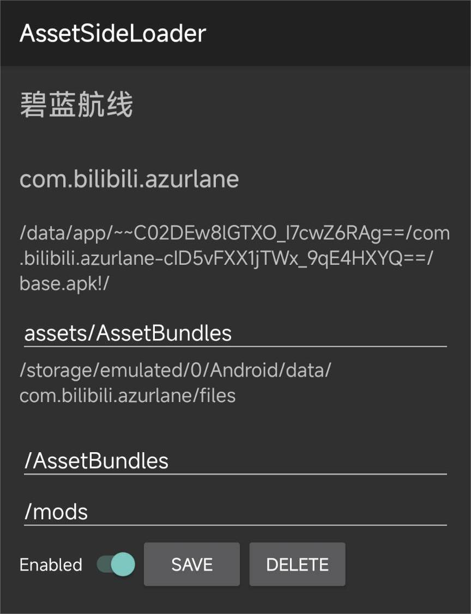

# AssetSideLoader

[README_EN.md](README_EN.md)

## 介绍

一个LSPosed模块，通过hook UnityEngine的内部方法实现从自定义路径加载文件，来替换External Storage或者APK中的资源。

---

## 说明

- 需要先手动授予“获取应用列表”权限
- 请先在LSPosed中激活模块，并且至少选择一个目标应用，之后启动APP
- 启动APP后可以在`SELECT APPS`中选择目标应用，然后点击`DONE`返回
  - 注意，即使在模块中选择了目标应用，也需要在LSPosed中为模块选择相应的目标应用
  - `SELECT APPS`中只会显示`lib`目录下存在`libil2cpp.so`的应用
- 选择目标应用后，可以在主界面点击对应的应用进入具体设置
  - 如果回到主界面后没有显示对应的应用，请重启APP
- 在具体设置中有三个路径需要手动填写
  - `APK Patch`：APK文件中的资源相对于`/data/app/*/*/base.apk!/`的路径
  - `Data Patch`：外部存储中的资源相对于`/storage/emulated/0/Android/com.example.www/files`的路径
  - `Mod Patch`：自定义的mod文件夹路径，与Data Patch一样是外部存储中的相对路径
  - APP期望在`Mod Patch`下有和`APK Patch`和`Data Patch`中要替换的文件相同的目录结构和文件名
- 选择好路径后，点击`SAVE`保存设置，点击`DELETE`删除设置,点击SWITCH切换是否启用
- 确定设定无误后，启动目标应用即可

## 示例

## 致谢

- Perfare: [Zygisk-Il2CppDumper](https://github.com/Perfare/Zygisk-Il2CppDumper)
- jmpewsL [Dobby](https://github.com/jmpews/Dobby)
- LSPosed: [LSPosed](https://github.com/LSPosed/LSPosed)